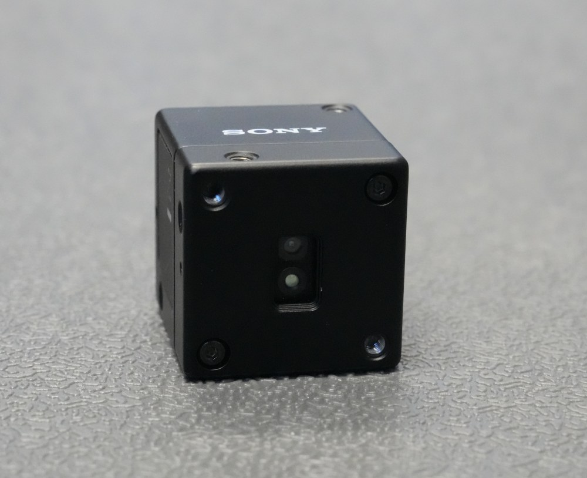
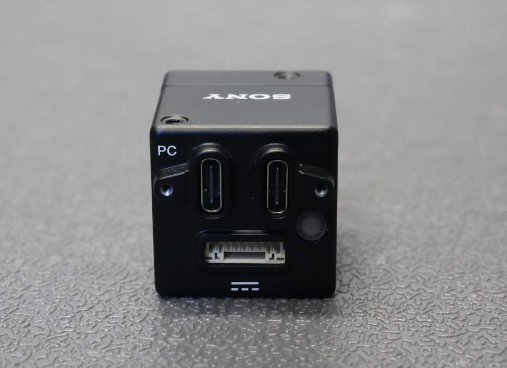
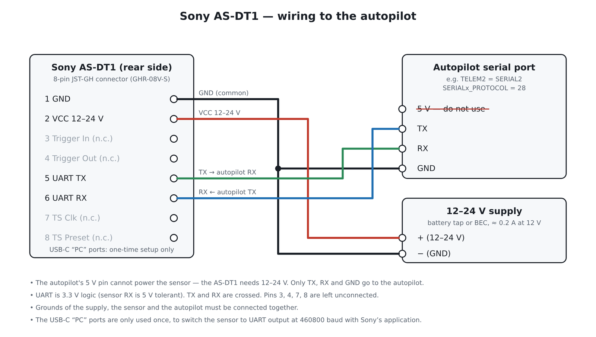

.. _common-sony-as-dt1:

=================
Sony AS-DT1 LiDAR
=================

The Sony AS-DT1 is a compact solid-state dToF (direct time-of-flight) LiDAR depth sensor. It measures up to 576 points at once over a field of view of roughly 37 x 29 degrees, has a range of about 20 m outdoors (bright ambient light) and up to 40 m indoors, uses an eye-safe Class 1 940 nm laser and weighs 50 g or less (29 x 29 x 31 mm).

ArduPilot supports the AS-DT1 as a forward-facing proximity sensor for :ref:`Object Avoidance <common-object-avoidance-landing-page>` through a Lua driver script, ``Sony_AS-DT1.lua``, found in the ArduPilot source tree under `libraries/AP_Scripting/drivers <https://github.com/ArduPilot/ardupilot/tree/master/libraries/AP_Scripting/drivers>`__. No companion computer is required.

.. note::

   Because the sensor only covers about 37 degrees horizontally, only the forward sector of ArduPilot's proximity boundary is populated. It is not a 360 degree Lidar.

Preparing the sensor
--------------------

Out of the box the AS-DT1 outputs its data over its USB-C port, not over the 8-pin connector used with the autopilot. Before wiring it to the vehicle, connect the sensor to a PC over USB-C once and use Sony's AS-DT1 sample application (part of the AS-DT1 SDK) to switch it to UART output and set the UART speed to 460800 baud. The setting is stored in the sensor. If you choose a different speed, set ``ASDT1_BAUD`` accordingly (see below).

Connecting to the Autopilot
---------------------------

The rear of the sensor carries the two USB-C ports (marked "PC", used only for the one-time setup and Sony's tools), the status LED and the 8-pin JST-GH connector. The 8-pin connector carries both power and the UART:

.. list-table::
   :header-rows: 1
   :widths: 10 20 70

   * - Pin
     - Signal
     - Connect to
   * - 1
     - GND
     - common ground (power supply and autopilot)
   * - 2
     - VCC
     - 12 V to 24 V from the battery or a BEC
   * - 5
     - UART TX
     - autopilot serial port RX
   * - 6
     - UART RX
     - autopilot serial port TX

.. warning::

   The AS-DT1 must be powered from **12 V to 24 V** (about 0.2 A at 12 V). The 5 V supplied by an autopilot's telemetry or serial port will not power it. Connect only TX, RX and GND to the autopilot.

The UART uses 3.3 V logic and the sensor's RX is 5 V tolerant, so it can be connected to any autopilot serial port. TX and RX are crossed as usual.

Installing the driver script
----------------------------

Copy ``Sony_AS-DT1.lua`` to the ``APM/scripts`` directory on the autopilot's SD card, or upload it with the ground station's script upload feature. See :ref:`common-lua-scripts` for general information about running Lua scripts.

Configuration through the Ground Station
----------------------------------------

Example setup for a sensor connected to Serial1 and used as the first proximity sensor:

- :ref:`SCR_ENABLE <SCR_ENABLE>` = 1 to enable scripting (reboot after changing this)
- :ref:`SCR_VM_I_COUNT <SCR_VM_I_COUNT>` = 50000 so the script has enough instruction budget to parse the sensor data
- :ref:`SERIAL1_PROTOCOL <SERIAL1_PROTOCOL>` = 28 ("Scripting") if using Serial1. :ref:`SERIAL1_BAUD <SERIAL1_BAUD>` does not need to be set, the script configures the baud rate itself
- :ref:`PRX1_TYPE <PRX1_TYPE>` = 15 ("Scripting")
- Reboot the autopilot

Once the script is running, a set of ``ASDT1_`` parameters appears in the parameter list (refresh the parameters if they are not visible after the first boot):

.. list-table::
   :header-rows: 1
   :widths: 22 12 66

   * - Parameter
     - Default
     - Description
   * - ``ASDT1_MODE``
     - 2
     - Operating mode: 2 = 2D, 4 = 2D+, 3 = 3D (see below). Read at boot, reboot to change
   * - ``ASDT1_BAND``
     - 90
     - 2D and 2D+ only. Only measurement points within +/- this angle (degrees) of the sensor horizon (2D) or of the true horizon (2D+) are used. The sensor covers about +/- 14.6 degrees, so 15 or more uses the full vertical field of view; 3 to 6 keeps a thin horizontal slice and reduces false ground or ceiling detections
   * - ``ASDT1_MIN_M``
     - 0.15
     - Measurements closer than this (meters) are discarded
   * - ``ASDT1_MAX_M``
     - 30
     - Measurements farther than this (meters) are ignored
   * - ``ASDT1_PITCH_OFF``
     - 0
     - Pitch of the sensor relative to the airframe in degrees, nose-up positive. Corrects a tilted mount; in 2D+ mode it is added to the vehicle pitch
   * - ``ASDT1_SP``
     - 1
     - Which scripting serial port the sensor is connected to (1 = the first port with ``SERIALx_PROTOCOL`` = 28). Read at boot
   * - ``ASDT1_BAUD``
     - 460800
     - Baud rate of the sensor UART, must match the speed configured with Sony's application. Read at boot
   * - ``ASDT1_DEBUG``
     - 1
     - Send driver status messages to the ground station

Operating modes
---------------

**2D (ASDT1_MODE = 2)**: the sensor frame is collapsed into horizontal sectors and the nearest distance of each sector is fed to the proximity library as a horizontal measurement. ArduPilot streams the result to the ground station as a MAVLink DISTANCE_SENSOR message and it can be used by Simple Object Avoidance and the BendyRuler / Dijkstra path planners (see the object avoidance pages of the Copter and Rover wikis). This is the recommended default.

**2D+ (ASDT1_MODE = 4)**: a multicopter pitches nose-down to accelerate and fly forward, so a fixed forward-facing sensor ends up looking at the ground and may report it as an obstacle, causing unwanted stops. In 2D+ mode the driver reads the vehicle's pitch and keeps the measurement rows that look at the true horizon instead of the rows around the sensor axis, so obstacles ahead stay in view during forward flight. Use it together with a narrow ``ASDT1_BAND`` (3 to 6 degrees). The compensation is limited by the sensor's vertical field of view: the horizon can only be tracked while the pitch stays within about +/- (14.6 - ``ASDT1_BAND``/2) degrees of the sensor axis. To extend this window in the nose-down direction, mount the sensor tilted up by the typical cruise nose-down angle and set ``ASDT1_PITCH_OFF`` to that angle.

**3D (ASDT1_MODE = 3)**: the frame is reduced to a 5 x 5 grid and the nearest point of each cell is fed as a 3D obstacle, giving full 3D obstacle avoidance and path planning. Note that "3D" refers to the vertical resolution within the sensor's field of view: the AS-DT1 only sees a cone of roughly 37 x 29 degrees in front of the vehicle, so 3D mode does not give all-round coverage like a 360 degree lidar or several sensors would.

Testing
-------

With ``ASDT1_DEBUG`` = 1 the driver reports its state as ground station messages within a few seconds of boot:

.. code-block:: none

   AS-DT1: sync ok
   AS-DT1: streaming @ 10 Hz, 2D 9 sectors, band +/-90 deg -> MAVLink
   AS-DT1[2D]: 9 sectors, nearest 1.24 m (MAVLink DISTANCE_SENSOR)

Objects 0.5 m to 3 m in front of the sensor should then be visible in Mission Planner's proximity viewer (Flight Data screen, press Ctrl-F and then the Proximity button). Very close objects return nothing: below roughly 0.5 m the sensor is in its near dead zone.

If "no scripting serial" is reported, check ``SERIALx_PROTOCOL`` and ``ASDT1_SP``. If "resync failed" is reported, check the wiring, the power supply, ``ASDT1_BAUD`` and that the sensor has been switched to UART output. If the script reports "exceeded time limit", raise :ref:`SCR_VM_I_COUNT <SCR_VM_I_COUNT>`.
